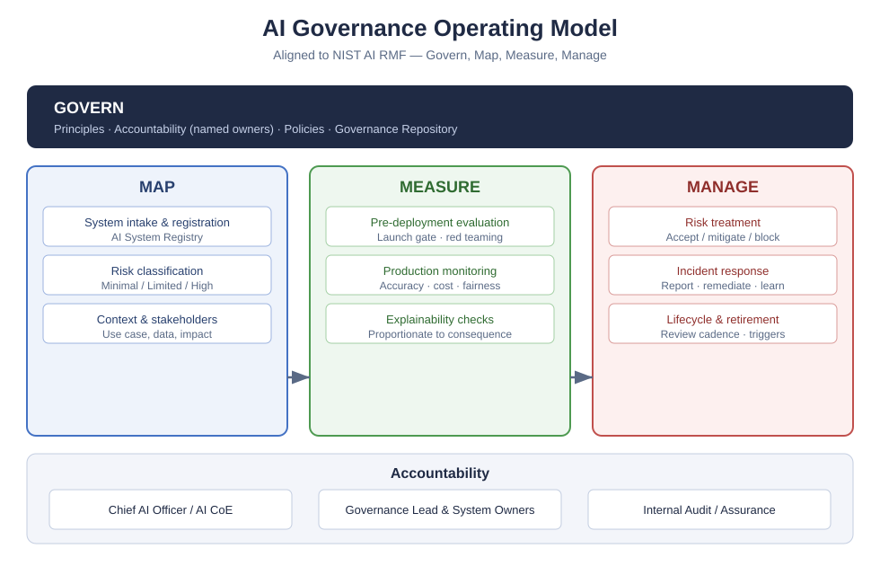

# AIEA Reference Framework
## Part 4: AI Enterprise Architecture Capability and Governance
### Document Number: AIEA-401 | Version 1.0 | 2026

---

## Preface

This document is Part 4 of the AIEA Reference Framework. It defines organisational structures, operating models, governance bodies, evidence mechanisms, maturity models, and role profiles for establishing and sustaining an enterprise AI architecture capability.

While Parts 1, 2, and 3 define *what* AI architecture is, *how* to develop it through the AI-ADM, and *which artifacts* to produce, Part 4 defines *who* conducts the work, *how decisions are authorised*, and *how evidence and risk decisions are governed* across complex regulatory landscapes.

This document MUST be read by Chief AI Officers, Enterprise Architecture leaders, Heads of AI Governance, and Risk and Compliance executives responsible for enterprise-wide AI adoption.

---

## Chapter 1: Establishing the AI Architecture Capability

### 1.1 Purpose and Strategic Imperative

An AI Architecture Capability is the institutional capacity of an enterprise to define, steer, govern, and optimize AI-enabled systems repeatably, safely, and in alignment with business objectives. 

Without an institutional capability, enterprise AI adoption exhibits predictable pathology:
- Fragmented shadow AI deployments across business units
- Duplicated foundation model contracts and uncontrolled inference costs
- Inconsistent compliance with global regulations (EU AI Act, DPDPA, NIST AI RMF)
- High-risk security vulnerabilities (OWASP LLM Top 10) in unmonitored production workloads
- Inability to transition proofs-of-concept into resilient production systems

Establishing an AI Architecture Capability transitions an enterprise from ad-hoc experimentation to disciplined, auditable, and value-accretive execution.

```
┌─────────────────────────────────────────────────────────────────────────┐
│              ENTERPRISE AI ARCHITECTURE CAPABILITY PILLARS              │
├───────────────────┬───────────────────┬────────────────────────────────┤
│  1. LEADERSHIP &  │  2. OPERATING     │  3. GOVERNANCE &               │
│     MANDATE       │     MODEL         │     AUTHORIZATION              │
│  Board charter,   │  CoE topology,    │  AI Architecture Board,        │
│  CAIO authority,  │  hub-and-spoke,   │  decision rights,              │
│  funding model    │  delivery pods    │  governance review gates       │
├───────────────────┼───────────────────┼────────────────────────────────┤
│  4. REGULATORY    │  5. REPOSITORY &  │  6. COMPETENCY &               │
│     ALIGNMENT     │     STANDARDS     │     CULTURE                    │
│  ISO 42001, NIST, │  Living registry, │  Role profiles, RACI,          │
│  EU AI Act, DPDPA │  building blocks  │  ethical safety training       │
└───────────────────┴───────────────────┴────────────────────────────────┘
```

### 1.2 Enterprise Capability Mandate and Charter

The AI Architecture Capability MUST be formally chartered by executive leadership (CEO, Board Audit/Technology Committee, or Group CIO/CAIO). The charter establishes:

1. **Jurisdiction:** All software, algorithms, foundation models, agents, and external AI services deployed across the enterprise or processing enterprise data fall under the mandate.
2. **Review Authority:** The AI Architecture Board (AIAB) holds binding review authority over architectural decisions, technology selections, and production deployments.
3. **Funding Mechanism:** A sustainable funding model combining shared corporate infrastructure funding (for common platforms, gateways, and governance tools) and chargeback/showback mechanisms for project-specific model inference.

### 1.3 Integration with Enterprise Architecture Practice

For enterprises with existing TOGAF-aligned Enterprise Architecture practices, the AI Architecture Capability MUST NOT operate as an isolated silo. It functions as an integrated domain capability:

- **Architecture Board Alignment:** The AI Architecture Board reports into or operates as a specialized standing subcommittee of the Group Enterprise Architecture Board (EAB).
- **Metamodel Integration:** AI Architecture Building Blocks (AI-ABBs) and Solution Building Blocks (AI-SBBs) are registered directly within the core Enterprise Architecture Repository.
- **Stage-Gate Synchronisation:** AI-ADM review gates integrate with existing corporate project investment and delivery stage-gates.

---

## Chapter 2: The AI Center of Excellence (AI CoE) & Operating Models

### 2.1 Operating Model Topologies

The AIEA Reference Framework recognizes three primary operating model topologies for AI architecture execution. Enterprises MUST formally select and document their operating topology in the Preliminary Phase.

```
TOPOLOGY A: CENTRALIZED            TOPOLOGY B: FEDERATED              TOPOLOGY C: HUB-AND-SPOKE
                                                                      (RECOMMENDED)

     ┌─────────────┐                    ┌─────────────┐                    ┌─────────────┐
     │ Central AI  │                    │ BU 1 AI Pod │                    │ Central Hub │
     │    CoE      │                    └─────────────┘                    │  (Core CoE) │
     └──────┬──────┘                    ┌─────────────┐                    └──────┬──────┘
       ┌────┴────┐                      │ BU 2 AI Pod │                      ┌────┴────┐
       ▼         ▼                      └─────────────┘                      ▼         ▼
    ┌─────┐   ┌─────┐                   ┌─────────────┐                   ┌─────┐   ┌─────┐
    │BU 1 │   │BU 2 │                   │ BU 3 AI Pod │                   │BU 1 │   │BU 2 │
    │App  │   │App  │                   └─────────────┘                   │Spoke│   │Spoke│
    └─────┘   └─────┘                                                     └─────┘   └─────┘
```

#### 2.1.1 Topology A: Centralized Model
- **Description:** A single enterprise AI Center of Excellence owns all AI architects, data scientists, model pipelines, and governance decisions.
- **Strengths:** Maximum architectural consistency, centralized cost control, uniform compliance.
- **Weaknesses:** Delivery bottleneck, reduced business context, slow responsiveness to domain-specific product teams.
- **Suitability:** Early-stage enterprises (AIEA Maturity Level 1–2) or highly homogeneous organizations.

#### 2.1.2 Topology B: Decentralized / Federated Model
- **Description:** Individual business units hire and operate their own AI engineering and architecture pods with minimal central coordination.
- **Strengths:** High business agility, rapid domain-specific prototyping.
- **Weaknesses:** Severe duplication of infrastructure, fragmented compliance, unmonitored shadow AI risks, zero enterprise economies of scale.
- **Suitability:** Not recommended for regulated enterprises; acceptable only in loosely coupled holding conglomerates.

#### 2.1.3 Topology C: Hybrid Hub-and-Spoke Model (Recommended)
- **Description:** A central **Hub (Core AI CoE)** provides shared enterprise infrastructure (AI Gateway, Vector Store platform, Guardrail framework, Model Evaluation Harness), standard architectural patterns, and governance policies. Dedicated **Spokes (Domain AI Architecture Pods)** sit embedded within Business Units to lead use case discovery, solution design, and rapid delivery.
- **Suitability:** Standard pattern for mature, regulated enterprises (AIEA Maturity Level 3+).

### 2.2 Hub vs. Spoke Division of Responsibilities

| Capability Domain | Central Hub (Core AI CoE) | Embedded Spoke (BU AI Pod) |
|---|---|---|
| **Standards & Principles** | Defines enterprise AI principles, reference models, and patterns | Adopts and adheres to enterprise standards |
| **Model Infrastructure** | Operates central AI Gateway, API keys, fallback routers, token caching | Configures application-level routing via central gateway |
| **Vendor Contracts** | Negotiates enterprise-wide model provider master service agreements | Consumes models under enterprise commercial agreements |
| **Governance & Gates** | Runs AI Architecture Board and defines compliance checklists | Prepares System Cards and compliance evidence |
| **Solution Design** | Reviews and approves high-risk solution architectures | Designs domain-specific RAG pipelines and business agents |
| **Observability** | Hosts centralized telemetry, cost attribution, and red-teaming tools | Monitors application-specific business metrics and user feedback |

---

## Chapter 3: AI Governance Structures & Architecture Board



*Figure 3-1. AI Governance Operating Model. This reference view supports governance design; it does not establish regulatory compliance.*

### 3.1 AI Architecture Board (AIAB) Charter

The AI Architecture Board (AIAB) is the permanent governance body responsible for the integrity, compliance, safety, and business alignment of all enterprise AI systems.

#### 3.1.1 Mandate and Authority
The AIAB is empowered by the Executive Committee to:
1. **Approve or Reject:** Grant, withhold, or revoke production deployment authorizations for AI systems.
2. **Mandate Remediations:** Require technical or operational remediations for systems exhibiting model drift, fairness violations, or security vulnerabilities.
3. **Grant Variances:** Issue time-bound architectural variances with explicit remediation roadmaps.
4. **Decommission:** Order the immediate containment or permanent decommissioning of non-compliant or compromised AI systems.

#### 3.1.2 Board Composition and Quorum

The AIAB MUST maintain cross-functional representation to ensure technical, legal, and operational oversight:

```
┌─────────────────────────────────────────────────────────────────────────┐
│                  AI ARCHITECTURE BOARD COMPOSITION                      │
├────────────────────────────────┬────────────────────────────────────────┤
│ PERMANENT VOTING MEMBERS       │ ADVISORY & EX-OFFICIO MEMBERS          │
├────────────────────────────────┼────────────────────────────────────────┤
│ • Lead AI Enterprise Architect │ • Chief Data Officer (CDO)             │
│   (Chair)                      │ • Business Unit Executive Sponsor      │
│ • Chief AI Officer / Group CTO │ • Internal Audit Representative        │
│ • AI Safety & Ethics Lead      │ • Procurement / Vendor Manager         │
│ • Chief Information Security   │ • Data Protection Officer (DPO)        │
│   Officer (CISO)               │                                        │
│ • Legal / Regulatory Counsel   │                                        │
└────────────────────────────────┴────────────────────────────────────────┘
```

**Quorum Requirement:** A valid decision requires attendance of at least 4 permanent voting members, including mandatory representation from Architecture, Security, and Legal/Compliance.

### 3.2 Governance Decision Tiers and Escalation Pathways

Governance decisions are tiered based on the AI System Risk Classification established in Part 1 and Part 3:

| Risk Tier | Review Body | Quorum Requirement | Approval Validity Period |
|---|---|---|---|
| **Prohibited** | Board of Directors / CEO | Unanimous Executive Review | Deployed systems must be terminated immediately |
| **High Risk** | Full AI Architecture Board (AIAB) | Full Voting Quorum (incl. Legal & CISO) | 12 months maximum before reassessment, or sooner after a material trigger |
| **Significant Risk** | AIAB Standing Committee | Lead Architect + Security Lead | 18 months |
| **Limited Risk** | Domain AI Architect (Spoke) | Lead Architect self-service audit | 24 months |
| **Minimal Risk** | Product Team Self-Service | Standard automated CI/CD policy gates | Indefinite (subject to periodic spot checks) |

---

## Chapter 4: Multi-Framework Alignment and Evidence

Enterprise AI systems operate under overlapping global, regional, and sector-specific requirements. AIEA provides a common evidence model to help organisations map controls and artifacts. It does not merge different legal instruments into a single legal conclusion and does not establish compliance.

```
┌─────────────────────────────────────────────────────────────────────────┐
│               AIEA MULTI-FRAMEWORK EVIDENCE MODEL                       │
├─────────────────────────────────────────────────────────────────────────┤
│                                                                         │
│    ┌───────────────┐     ┌───────────────┐     ┌───────────────┐        │
│    │ NIST AI RMF   │     │ ISO/IEC 42001 │     │  EU AI ACT    │        │
│    │ 1.0 & 600-1   │     │     2023      │     │     2024      │        │
│    │ (Risk Mgmt)   │     │ (Management)  │     │ (Obligations) │        │
│    └───────┬───────┘     └───────┬───────┘     └───────┬───────┘        │
│            │                     │                     │                │
│            └──────────────┐      │      ┌──────────────┘                │
│                           ▼      ▼      ▼                               │
│                    ┌────────────────────────────┐                       │
│                    │    AIEA CORE GOVERNANCE    │                       │
│                    │     CONTROL REPOSITORY     │                       │
│                    └─────────────┬──────────────┘                       │
│                                  │                                      │
│            ┌─────────────────────┴─────────────────────┐                │
│            ▼                                           ▼                │
│   ┌───────────────────┐                       ┌───────────────────┐     │
│   │   INDIA DPDPA     │                       │ SECTOR STANDARDS  │     │
│   │    & MeitY AI     │                       │  (RBI, SEBI, FDA) │     │
│   └───────────────────┘                       └───────────────────┘     │
└─────────────────────────────────────────────────────────────────────────┘
```

### 4.1 NIST AI Risk Management Framework (NIST AI RMF 1.0 & AI 600-1)

Organisations using the NIST AI RMF mapping SHOULD address all four functions across the AI-ADM and document any non-applicable activities:

#### 4.1.1 GOVERN Function
- **AIEA Implementation:** AI Architecture Principles (Part 1), AIAB Charter (Part 4, Chapter 3), and System Owner accountability records.
- **Artifacts:** Governance Charter, Responsible AI Policy, Risk Tolerance Statement.

#### 4.1.2 MAP Function
- **AIEA Implementation:** Executed during AI-ADM Phase 0, Phase A, and Phase B. Contextualizes the AI system within business workflows, identifies affected stakeholder groups, and establishes risk classifications.
- **Artifacts:** AI Opportunity Statement, Stakeholder Impact Assessment, Context of Use Document.

#### 4.1.3 MEASURE Function
- **AIEA Implementation:** Executed during AI-ADM Phase E, Phase F, and Gate 2 (Pre-Deployment). Employs quantitative benchmarks, red teaming, fairness metrics, and toxicity evaluations.
- **Artifacts:** Pre-Deployment Evaluation Report, Adversarial Red-Team Findings, Performance Scorecard.

#### 4.1.4 MANAGE Function
- **AIEA Implementation:** Executed continuously in AI-ADM Phase I and Phase J. Provides post-deployment telemetry, drift alerts, incident runbooks, and continuous model optimization.
- **Artifacts:** AI Incident Log, Post-Market Monitoring Dashboard, Model Retirement Plan.

### 4.2 ISO/IEC 42001:2023 AI Management System Integration

ISO/IEC 42001 is a certifiable international standard for Artificial Intelligence Management Systems (AIMS). The table identifies AIEA artifacts that may support alignment; only organisation-specific implementation and an appropriate audit can establish conformity or certification:

| ISO/IEC 42001 Clause | Requirement Theme | Potential AIEA Supporting Evidence |
|---|---|---|
| **Clause 4: Context** | Determine internal/external issues & stakeholder expectations | Preliminary Phase: AI Readiness & Regulatory Context Assessment |
| **Clause 5: Leadership** | Top management commitment & AI Policy | AI Architecture Principles + CAIO charter signed by Board |
| **Clause 6: Planning** | Actions to address AI risks and objectives | AI-ADM Phase 0 & Phase F: Risk Treatment Plan |
| **Clause 7: Support** | Resources, competence, awareness, documentation | Part 4: Capability Model, AIEA Registry, Competency Framework |
| **Clause 8: Operation** | Operational planning, risk assessment, impact assessment | AI-ADM Phases B through I + Gate Review Procedures |
| **Clause 9: Performance** | Monitoring, measurement, analysis, internal audit | Post-Market Telemetry + Annual AIAB Architecture Audit |
| **Clause 10: Improvement** | Nonconformity, corrective action, continual improvement | AI-ADM Phase J: Change Management + Incident Retrospectives |
| **Annex A Controls** | AI system lifecycle, data governance, third-party AI | Part 3 Artifacts: Data Contracts, System Cards, Gate Reviews |

### 4.3 EU AI Act (2024) Evidence Mapping

For systems within the EU AI Act's scope, determine the organisation's role, system classification, applicable provisions, and commencement dates before selecting controls. The following AIEA procedures can support evidence collection but do not replace legal analysis:

```
┌─────────────────────────────────────────────────────────────────────────┐
│                    EU AI ACT OBLIGATION MAPPING                         │
├───────────────────┬─────────────────────────────────────────────────────┤
│ CLASSIFICATION    │ AIEA MANDATORY ARCHITECTURAL CONTROLS               │
├───────────────────┼─────────────────────────────────────────────────────┤
│ 1. PROHIBITED     │ Architectural gate rejection: Social scoring,       │
│    (Article 5)    │ biometric categorization for sensitive attributes,  │
│                   │ untargeted facial scraping, cognitive manipulation. │
├───────────────────┼─────────────────────────────────────────────────────┤
│ 2. HIGH RISK      │ • Conformity Assessment Package (Part 3)            │
│    (Annex III &   │ • AI System Card with full provenance (Section 2.2) │
│     Article 6)    │ • Human Oversight Architecture (Principle D4)       │
│                   │ • Post-Market Monitoring Plan (Part 4, Chapter 7)   │
│                   │ • Automated logging for 6+ months (Article 12)      │
├───────────────────┼─────────────────────────────────────────────────────┤
│ 3. GENERAL-       │ • Technical documentation on model training & compute│
│    PURPOSE AI     │ • Copyright compliance policy validation            │
│    (GPAI / LLMs)  │ • Model evaluation & systemic risk red teaming      │
├───────────────────┼─────────────────────────────────────────────────────┤
│ 4. TRANSPARENCY   │ Direct user disclosure ("AI-generated output"),     │
│    (Article 50)   │ synthetic media watermarking (C2PA standard).       │
└───────────────────┴─────────────────────────────────────────────────────┘
```

### 4.4 India Digital Personal Data Protection Act 2023 and Rules 2025

For organisations processing digital personal data within the framework's territorial scope, first check the relevant commencement notification and any sector-specific requirements:

1. **Processing Ground Verification:** AI-ADM Phase C MUST document whether processing relies on consent or a certain legitimate use available under the Act, including purpose, notice, withdrawal, and retention implications.
2. **Significant Data Fiduciary (SDF) Requirements:** If the enterprise is designated an SDF:
   - A Data Protection Officer (DPO) resident in India MUST serve on the AIAB for high-risk reviews.
   - Independent Data Audits and Periodic Data Protection Impact Assessments (DPIAs) MUST be logged in the AIEA Governance Repository.
3. **Children's Data Restrictions:** Under DPDPA Section 9, AI models MUST NOT process data of children for behavioural tracking, targeted advertising, or harmful profiling.
4. **Erasure and Derived Artifacts:** Systems using personal data for fine-tuning, retrieval, logs, or memory MUST identify where the data and derived artifacts reside, assess applicable erasure duties and retention exceptions, and document the technically and legally appropriate remediation. The Act does not prescribe a universal “model unlearning” method.

---

## Chapter 5: AI Architecture Capability Maturity Model (AIEA-CMM)

The AIEA-CMM defines a structured progression for organizations to assess their current capabilities and plan multi-year investments.

### 5.1 Maturity Levels Overview

```
LEVEL 1: INITIAL / AD-HOC
• No formal AI standards; unmonitored shadow AI API keys; ad-hoc experimentation.

LEVEL 2: EMERGING / REPEATABLE
• Basic AI CoE formed; initial AI Gateway; pilot use cases tracked in manual spreadsheets.

LEVEL 3: DEFINED / STANDARDIZED (BASELINE TARGET)
• AI-ADM formally adopted; AIAB active; central AI Gateway in production; System Cards mandatory.

LEVEL 4: MANAGED / QUANTITATIVE
• Automated compliance gates in CI/CD; quantitative FinOps token attribution; real-time drift alerting.

LEVEL 5: OPTIMIZING / CONTINUOUS
• Self-healing agentic architectures; automated red-teaming harnesses; dynamic policy enforcement.
```

### 5.2 Six-Dimension Maturity Assessment Rubric

Enterprises assess their maturity annually using the following rubric (scored 1.0 to 5.0):

| Dimension | Level 1: Initial | Level 3: Defined | Level 5: Optimizing |
|---|---|---|---|
| **1. Strategy & Value** | Undefined; AI treated as speculative hobby | Formal AI portfolio aligned with business KPIs | Dynamic value optimization; self-adjusting ROI prioritization |
| **2. Architecture Method** | No structured method; direct code to production | Full AI-ADM executed for all production initiatives | Continuous automated architecture generation and linting |
| **3. Governance & Risk** | No review board; terms of service ignored | AIAB active; System Cards maintained; Gate reviews enforced | Real-time automated guardrails; continuous algorithmic auditing |
| **4. Technology & Infrastructure** | Unmanaged SaaS subscriptions; scattered API keys | Shared AI Gateway, standardized RAG stack, Vector DB standards | Unified inference fabric, multi-cloud model routing, automated failover |
| **5. Data & Model Ops** | Ad-hoc CSV uploads; untracked prompt changes | Data contracts, versioned embeddings, automated evals | Automated continuous fine-tuning, closed-loop evaluation pipelines |
| **6. FinOps & Economics** | Surprise monthly vendor invoices; zero visibility | Team-level token quotas, chargeback reports, semantic caching | Dynamic cost/quality model arbitration, automated context compression |

---

## Chapter 6: Governance Review Gates & Production Launch Requirements

The AI-ADM enforces five formal review gates across the system lifecycle. Advancing past a gate requires formal sign-off from designated authorities.

```
┌─────────────┐     ┌─────────────┐     ┌─────────────┐     ┌─────────────┐     ┌─────────────┐
│   GATE 0    │     │   GATE 1    │     │   GATE 2    │     │   GATE 3    │     │   GATE 4    │
│ Opportunity │ ──> │ Design &    │ ──> │ Validation  │ ──> │ Production  │ ──> │ Operational │
│ & Feasibility│    │ Architecture│     │ & Red Team  │     │ Launch      │     │ Review      │
└─────────────┘     └─────────────┘     └─────────────┘     └─────────────┘     └─────────────┘
  (End Phase 0)       (End Phase F)       (Mid Phase I)       (End Phase I)       (Phase J / Post)
```

### 6.1 Gate 0: Opportunity & Feasibility Gate
- **Timing:** Concluding Phase 0 (AI Strategy & Opportunity).
- **Required Evidence:** AI Opportunity Statement, preliminary risk classification, initial business case, data availability confirmation.
- **Approver:** Domain AI Architect + Business Sponsor.
- **Criteria:** Clear business value metric; data is legally permissible for use; preliminary risk does not trigger Prohibited classification.

### 6.2 Gate 1: Architecture Design Review (ADR)
- **Timing:** Concluding Phase F (AI Governance Architecture).
- **Required Evidence:** AI Architecture Vision Document, Logical System Architecture, Data Contract, Draft AI System Card, Threat Model (OWASP LLM aligned).
- **Approver:** AI Architecture Board (Standing Review).
- **Criteria:** Adheres to enterprise reference models; model provider abstraction implemented; data sovereignty verified; security guardrails designed.

### 6.3 Gate 2: Pre-Deployment Validation & Red Teaming Gate
- **Timing:** During Phase I (Implementation Governance), prior to staging/pre-production traffic.
- **Required Evidence:** Benchmark Evaluation Report, Adversarial Red Teaming Findings, Bias/Fairness Audit, Latency/Load Test Report, Cost Projection Model.
- **Approver:** AI Safety & Red Team Lead + Lead AI Architect.
- **Criteria:** Accuracy exceeds documented threshold; zero critical prompt injection vulnerabilities; jailbreak resilience verified; cost limits configured.

### 6.4 Gate 3: Production Launch Authorization
- **Timing:** Immediate precursor to routing production enterprise or customer traffic.
- **Required Evidence:** Completed AI System Card (signed by System Owner), Operational Telemetry Live, Incident Response Runbook, Legal Regulatory Sign-off.
- **Approver:** Full AI Architecture Board (Quorum).
- **Criteria:** All mandatory regulatory documentation complete; real-time guardrails live; human-in-the-loop controls operational; named System Owner confirmed.

### 6.5 Gate 4: Operational & Post-Market Review
- **Timing:** 90 days post-launch, and recurring annually thereafter.
- **Required Evidence:** 90-day drift metrics, token spend vs. budget report, incident log, user feedback analysis, regulatory update check.
- **Approver:** Domain AI Architect + System Owner.
- **Criteria:** System operates within performance and cost SLA; no unresolved high-severity incidents; business KPIs realized.

---

## Chapter 7: Operational Governance, Monitoring & Incident Management

### 7.1 Post-Market Telemetry and Observability

Every production AI system MUST stream telemetry to the centralized enterprise observability fabric. Monitoring MUST capture the four vital signs of enterprise AI:

```
┌─────────────────────────────────────────────────────────────────────────┐
│                    THE FOUR AI ARCHITECTURE VITALS                      │
├───────────────────────────────┬─────────────────────────────────────────┤
│ 1. QUALITY & DRIFT            │ 2. SAFETY & SECURITY                    │
│ • Groundedness / hallucination│ • Prompt injection attempts             │
│ • Embedding drift & data shift│ • Jailbreak detection rate              │
│ • Human escalation rate       │ • PII leakage / egress intercept        │
│ • Answer relevance & latency  │ • Toxicity & policy violation count     │
├───────────────────────────────┼─────────────────────────────────────────┤
│ 3. ECONOMICS & FINOPS         │ 4. OPERATIONAL PERFORMANCE              │
│ • Input/output token volume   │ • P95 and P99 inference latency         │
│ • Cost per query / per user   │ • Gateway error rates & timeouts        │
│ • Semantic cache hit ratio    │ • Fallback trigger frequency            │
│ • Budget cap consumption rate │ • Upstream provider availability        │
└───────────────────────────────┴─────────────────────────────────────────┘
```

### 7.2 AI Incident Classification Framework

When an AI system produces anomalous, harmful, or compromised outputs, incidents MUST be triaged according to the AIEA Severity Matrix:

| Severity Level | Definition | Impact Scope | Response SLA |
|---|---|---|---|
| **Severity 1: Critical** | Exploited zero-day prompt injection; active PII data breach; autonomous agent executed unauthorized financial/system transaction; dangerous hallucination in clinical/safety context. | Widespread / External Legal Liability | Response: < 15 mins<br>Containment: < 1 hour |
| **Severity 2: Major** | High-rate jailbreak bypass; foundation model outage without automatic fallback; major data drift causing systemic erroneous recommendations; cost runaway exceeding budget cap by 50%. | Department-wide / Reputational Risk | Response: < 1 hour<br>Containment: < 4 hours |
| **Severity 3: Moderate** | Isolated hallucination caught by guardrail; elevated latency exceeding SLA; semantic cache corruption; minor bias detected in evaluation run. | Internal / Non-consequential | Response: < 8 hours<br>Remediation: < 48 hours |
| **Severity 4: Minor** | Cosmetically poor formatting; minor prompt syntax warning; non-critical documentation discrepancy in System Card. | Isolated | Response: < 24 hours<br>Next Sprint Release |

### 7.3 Emergency AI Kill-Switch and Containment Procedures

All production AI architectures MUST implement an emergency containment procedure ("Kill-Switch") capable of execution within 5 minutes of a Severity 1 declaration:

1. **Traffic Cutover:** The AI Gateway redirects all user traffic from the affected model to:
   - A static fallback rule/template ("System temporarily unavailable")
   - A verified, deterministic legacy rules engine
   - A secondary, air-gapped backup foundation model
2. **Session Termination & Token Revocation:** Immediate invalidation of active agent session states and tool execution API tokens.
3. **Data Egress Isolation:** Vector database access and enterprise tool connectors are placed into read-only quarantine.
4. **Regulatory Notification Checklist:** Execution of statutory notifications within mandatory timeframes:
   - **EU AI Act (Article 73):** Report serious incidents to market surveillance authorities within **72 hours**.
   - **India DPDPA / CERT-In:** Report personal data breaches to the Data Protection Board and CERT-In within **6 hours** of confirmation.

---

## Chapter 8: Roles, Responsibilities, and RACI

### 8.1 Core Role Profiles

Establishing the capability requires clearly defined roles across the architecture and engineering spectrum:

- **Chief AI Officer (CAIO):** Executive accountable for the enterprise AI strategy, budget, and enterprise risk profile.
- **Lead AI Enterprise Architect:** Technical leader accountable for AI-ADM execution, reference architectures, technical standards, and AIAB chairmanship.
- **Domain AI Architect:** Embedded within business units; designs solution architectures, leads Phase B–E development, and prepares gate deliverables.
- **AI Safety & Red Team Lead:** Technical risk specialist responsible for adversarial red teaming, jailbreak resistance, guardrail tuning, and bias evaluations.
- **Data Architect (AI Domain):** Specialist accountable for data pipelines, feature stores, vector database architectures, and data contracts.
- **AI Product Owner / System Owner:** Named business individual accountable for system business outcomes, System Card maintenance, and operational oversight.

### 8.2 Enterprise RACI Matrix Across the AI-ADM

```
R = Responsible (Completes the work)
A = Accountable (Approves; single point of accountability)
C = Consulted (Provides two-way input)
I = Informed (Kept updated on progress)
```

| AI-ADM Phase | CAIO | Lead AI Architect | Domain AI Architect | AI Safety Lead | Data Architect | System Owner | CISO | Legal / DPO |
|---|---|---|---|---|---|---|---|---|
| **Preliminary: Readiness** | **A** | **R** | C | C | C | I | C | C |
| **Phase 0: AI Strategy & Opp.** | **A** | C | **R** | I | C | **R** | I | I |
| **Phase A: Architecture Vision** | I | **A** | **R** | C | C | C | C | C |
| **Phase B: Business Arch.** | I | C | **R** | I | I | **A** | I | I |
| **Phase C: Data Architecture** | I | C | C | I | **R** / **A** | C | C | C |
| **Phase D: Application Arch.** | I | C | **R** / **A** | C | C | C | C | I |
| **Phase E: Technology Arch.** | I | **A** | **R** | C | C | I | C | I |
| **Phase F: Governance Arch.** | C | **A** | **R** | **R** | C | C | **A** | **A** |
| **Phase G: Solutions & Roadmap**| C | **A** | **R** | I | C | C | I | I |
| **Phase H: Migration Planning** | I | C | **R** / **A** | I | C | C | I | I |
| **Phase I: Implementation Gov.**| I | **A** | **R** | **R** | C | C | C | C |
| **Phase J: Change Management**  | I | **A** | **R** | C | C | **A** | C | I |
| **Gate 2: Red Team Review**    | I | C | C | **R** / **A** | I | I | C | I |
| **Gate 3: Production Auth.**   | C | **A** | C | C | I | **A** | C | C |
| **Incident: Sev 1 Response**   | **A** | **R** | **R** | **R** | C | C | **R** | **R** |

---

### Primary References

1. NIST, [AI Risk Management Framework](https://www.nist.gov/itl/ai-risk-management-framework).
2. ISO, [ISO/IEC 42001 — AI management systems](https://www.iso.org/standard/81230.html).
3. European Union, [Regulation (EU) 2024/1689](https://eur-lex.europa.eu/eli/reg/2024/1689/oj).
4. Ministry of Electronics and Information Technology, [India data-protection acts, rules, and notifications](https://www.meity.gov.in/documents/act-and-policies).

*AIEA Reference Framework Part 4: AI Enterprise Architecture Capability and Governance. Document AIEA-401, Version 1.0, 2026.*
*Next: Part 5 — AI Reference Models and Technical Standards (AIEA-501)*
