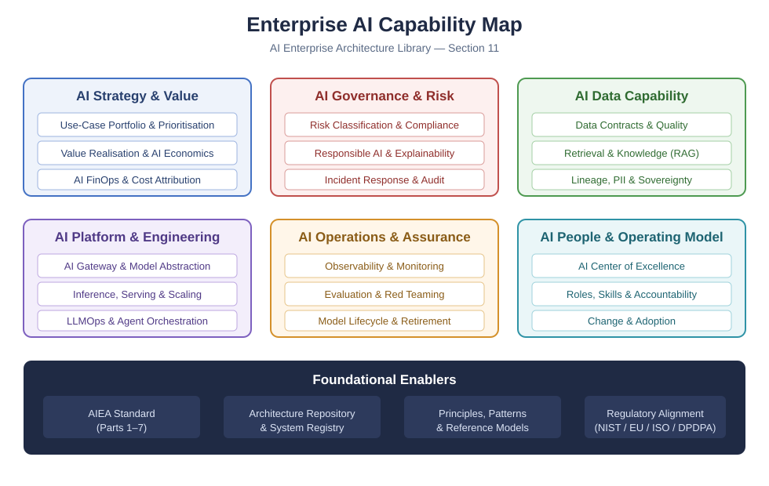

# Section 11 — Architecture Diagrams

> Actual diagram files — not descriptions of diagrams. ArchiMate models use the Open Group **Model Exchange File Format** and are intended for import into compatible modelling tools; validate the files against the target tool and exchange schema before production use. Rendered views are provided as accessible **SVG** files.

---

## Rendered Reference Views

### Enterprise AI Capability Map

*Figure 11-1. Enterprise AI Capability Map. Author-created reference view; use as a starting point and tailor capability boundaries to the organisation.*

### AI Governance Operating Model

*Figure 11-2. AI Governance Operating Model. Author-created reference view; framework alignment does not establish compliance.*

### ArchiMate (`.archimate` — Model Exchange File Format 3.x)

| File | Model |
|---|---|
| [ArchiMate/EA-AI-Reference-Architecture.archimate](ArchiMate/EA-AI-Reference-Architecture.archimate) | The enterprise AI reference architecture across Business, Application, and Technology layers |
| [ArchiMate/Agentic-AI-Operating-Model.archimate](ArchiMate/Agentic-AI-Operating-Model.archimate) | The agentic AI operating model (agent subsystems, orchestration, governance harness) |

### SVG (rendered views)

| File | View |
|---|---|
| [SVG/Enterprise-AI-Capability-Map.svg](SVG/Enterprise-AI-Capability-Map.svg) | Enterprise AI capability map |
| [SVG/AI-Governance-Operating-Model.svg](SVG/AI-Governance-Operating-Model.svg) | AI governance operating model |

---

## How to Use

- **Open the `.archimate` files** in [Archi](https://www.archimatetool.com/) (free) via *File → Import → Model From Open Exchange File*. They contain elements and relationships; tools can auto-layout views.
- **View the `.svg` files** directly in a browser or in the GitHub file preview.

These assets back the reference architectures referenced by [WG2](../09-WG-Outputs/WG2-EA-AI-Native/README.md) and [WG5](../09-WG-Outputs/WG5-Scaling-Agentic-AI/README.md), and align with [AIEA-501 Reference Models](../05-Standards/AIEA-501-Reference-Models.md).
